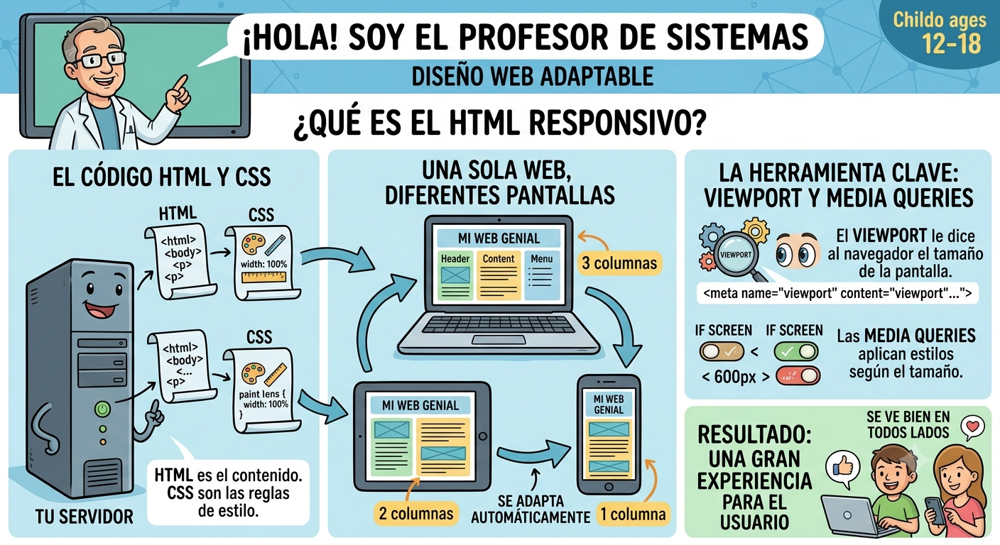

# Responsive_html

El diseño web responsivo consiste en crear páginas web que se vean bien en todos los dispositivos.

Un diseño web adaptable se ajustará automáticamente a diferentes tamaños de pantalla y ventanas gráficas.

## ¿Qué es el diseño web adaptable?
El diseño web adaptable consiste en utilizar HTML y CSS para redimensionar, ocultar, reducir o ampliar automáticamente un sitio web, para que se vea bien en todos los dispositivos (ordenadores de escritorio, tabletas y teléfonos)

## Etiquetas y propiedades utilizadas 

- Para crear un sitio web adaptable, se agrega la siguiente <meta> y se etiqueta a todas sus páginas web

- Para adaptar y escaclar una imagen hacia arriba y hacia abajo se debe establecer la propiedad width al 100%, otra opcion es usar la propiedad max-width.

- Para definir imagenes para diferentes tamaños de la ventana del navegador se usa el elemento html<picture>

- Para cambiar el tamñao del texto se puede configurar la unidad "vw" que significa "ancho de la ventana grafica" y asi el tamaño del texto se ajustara al tamaño de la ventana gráfica.

